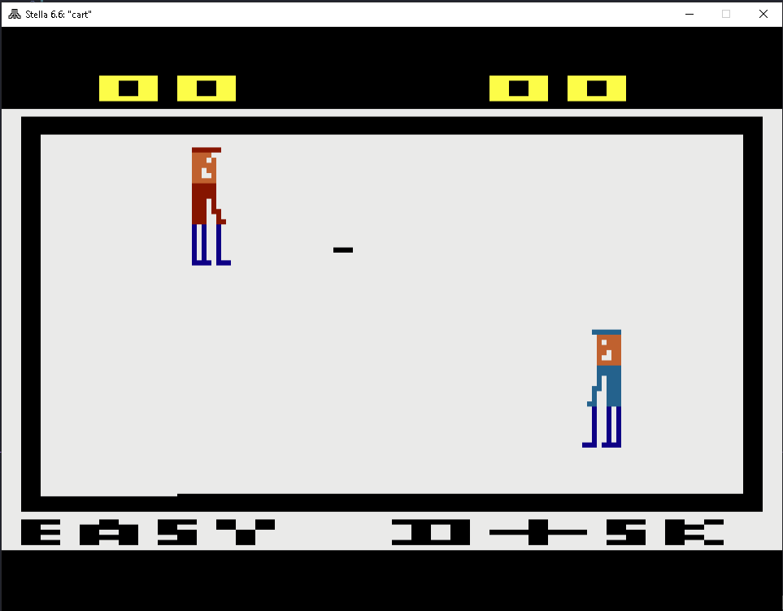

# Projeto - [Easy D-i-sk]
Jogo feito em assembly para a disciplina de Interface Hardware-Software do curso de Engenharia da Computação da Universidade Federal de Sergipe.

# Imagens

# Arquivos
* **'parcial_1'** e **'parcial_21** contém arquivos parciais, ou seja, arquivos que foram criados ao longo do tempo para o desenvolvimento
* **'midi_python'** é o projeto em python feito, para facilmente gerar sons para o atari
* **Apresentação Inicio.pdf** é o arquivo usado na apresentação inicial, antes de mostrar o código
* **Apresentação.pdf** é o arquivo usado para mostrar os fundamentos do atari
* **Interface Hardware Software.pdf** é o arquivo usado para apresentar a proposta primeiramente

# Funcionamento
O jogo é composto por uma arena (preta) onde os dois players (Player 0 e Player 1) podem se mover até metade da arena. Cada Player pode
rebater o disco. O objetivo do jogo consiste em conseguir fazer 5 gols primeiro. Há algumas características importantes:
1. Quando ocorre um gol, a posição que bola nasce no eixo-y é aleatória, porém sempre no mesmo valor do eixo-x (meio do jogo).
1. Quando a bola é rebatida por um Player, ela pode ser rebatida em uma velocidade normal, ou duas vezes mais rápido. Isso também ocorre
de maneira aleatória.
1. Quando há um game over, uma tela aparece indicando quem ganhou e para jogar novamente, basta reiniciar o jogo.
1. Há animação dos dois players
1. Há som quando a bola bate em um Player ou ocorre um gol.
1. Há um som de fundo, cujo arquivo tem o nome 'sfx.asm'.
1. Há dois placares e o nome do jogo

# Vídeo de Apresentação
Vídeo da apresentação no [Youtube](https://www.youtube.com/watch?v=3h19bnORkWg)

# Vídeo de Fundamentos do Atari
Vídeo da apresentação no [Youtube](https://www.youtube.com/watch?v=0h6yHRecvRQ)

# Link para jogar o Jogo
Basta clicar [aqui](https://8bitworkshop.com/v3.9.0/player.html?p=vcs&r=TFpHAAAQAAAABS6Mc9oVARIjKCt42KIAiqjKmkjQ%2B6kehYCpboWBqS2FgqkKhYOpAIWEK2GFqUaFjakyhY6pAYWPKAiQqdSFkSthkigElithlythmKkChQGFAIUCKyIoCAArYQkoxis9KyqlgKAAIIP1pYGgASvCjaAEK8Egl%2FUg%2FfUoFyqpAIUBpJfAAfADTO7wqR6FBigJCSthGaJfvZb4KLsbytD0KAoGKEVMoPOkmCimHPEoJgcjCSb6KOYcKOYHIwUmKAMNhQ6FD4UbhRyFCYUKKC0IogWkibkc9inwhYukhyhBDwWLhYsoKQ6kiijQjKSIKNCMhYwgt%2FUoESgXhA7mieaK5ofmiCgLyoUO0LkjIyAjBFcjA%2BSiAIYNhg6GDyMDig6GCSgICKIhhgojBRbghg2i%2FyhYIywaoiAoEACGDithD6JGqQDkjtACqQKFH4o45YLFGJACqQAYZZSouWz2KCUbuQL3hQYoEoMjBhKVqLm3KFIcuU33hQfK0L%2BpAIWUK2GVIxdnIwWdIyfhCCthCqJgKCZNhg6iAoYP6isFovAoDBEoDBUoZiMcGiMCwekjDRqgIwUaDCMcGiMGXqwoBgEjBhoomH0oCgUjHBgjBFrkIwoYIwYbECgNDSMcGyMUXiMyBSMbGSMpXiNjUSN9MSspI2IcqRAsgALQDKWCyS8QBuaCqRmFlKkgIwYLAjAGxoKpMigLQCjLgMkDKAuAI0MDgCMGCzooMSjLASjLgyMDRIOpGYWVqQIjBgsocYOpMigLBCjLgclOKAuBKDGVqQgjBguCKDEoy0AkAtADTJr0I4JSILj1IO31pZIQJSgTk0y89CgWAygWKAEAIwkWI2KuKJYBhZOFLKWOyUYQCSuhBTAITNf0xpArgeYrgqWQySNi4eX05o5M5%2FTGjqWNyYYQDEzw9CgBAzALTBT15oUgD%2FZMCfXmhCvkINH1I4PhAIWTpY8otTL1pZMogS315o3mjUxEK8ErgSMFDUL1xo3GKEjGjaWEyQXQA0xW9aWFKAEtTGv1KD6EhYWpAYWXIwNMUIWOTIAjCA2YIwkNTEfwhQI46Q%2Bw%2FEkHCisBmSAAmRAAYKIBtYQpD4WGCgplhpWHKATwSkqFhkpKKAaJyhDjYGCpA4UZqQWFFaWNSihSqR845YapD4UXYKWRCkUrQytiJpEoFkqFjqkUZY6FjmClkgpFK0MrYiaSYKkBhRqklrmY94UY5papBYUWIwRPDYUVqQSFF2B3VVVVdxErAncRd0R3dxEzESgLKAooBRF3K4FVKAwoVlUoQigRdyIoAitBZigHREREd2YoOWYoICg0RGZERAD3pCsE5uTs6Oj4KwHI2Pjo8PzwAD9%2BWn5%2BemZ%2B%2F%2FHx8fn18%2FGhKwOvrwCvKMKh8fP1%2BSgU%2F%2FzM9Pz8tPx4AO8lKwRnJyc3FxcfHx8TGx8XHz8PAH8%2FLT8%2FPTM%2F%2F4%2BPj5%2Bvz4%2BFKwP19QD1KMKFj8%2BvnygU%2Fz8zLz8oJB4AcCsFMCsFNisDMDAAIwUCNkArBSMGISMHKiMGESMHKiMGESMF4KQo0aSkACjCIwYPpKQjD0MjDyoAABcrCR0rCSMKEBYrCSMKECsdGisJIxYcIxZ8KwofKwkjHDQjFhDHx8%2Fb29Pz8wAAGCsFAMPn%2F9vDKwEAAAD%2FKMs4KAMrAcfO3Pj%2Fw8P%2FAP%2F%2FwCtDKKw8ZsOBACgOKBIo0ysDACuCKKUoMCMbXP%2F%2FgP%2F%2FAf8oYSMdXCMJXP8rHysfKx8rHysfKx8rHysfKx8rHysfKx8rHysbAPAA8A%3D%3D)

# Ferramentas Utilizadas
* Linguagem Assembly do Atari
* Editor de código - Visual Studio Code
* Emulador - Stella
* Assembler - DASM
* Ferramenta Online para debug e emulação - [8bitworkshop](https://8bitworkshop.com/)

# Controles do Jogo
* Player 0 - Basta usar as teclas direcionais do teclado 
* Player 1 - No emulador Stella y(cima), h(baixo), g(esquerda), j(direita)

# Como jogar

## Primeiro Caminho - Emulador Online
1. Acesse o site do [8bitworkshop](https://8bitworkshop.com/), e clique no botão 'Open 8bitworkshop IDE'.
1. Logo após, acesse o arquivo *disk.asm* e copie o seu conteúdo colando-o em seguida na página aberta pelo site 8bitworkshop.
1. Por fim, basta obter o arquivo *sfx.asm* e colocá-lo no site do 8bitworkshop. Para isso, vá até icone em hamburguer que fica do lado
esquerdo superior, e escolha a opção upload realizando assim o uploado do arquivo requerido. Feito isso, o jogo já estará rodando.

## Segundo Caminho - Emulado Offline
1. Instalar o Stella no estilo 'next next fisish'.
1. Instalar o dasm, colocando-o como uma variável de ambiente do sistema.
1. Após isso, clone o repositório, entre na pasta e execute o comando 'dasm disk.asm -f3 -v0 -ocart'.
1. Feito isso, será gerado um arquivo 'cart'. Renomeie-o para 'cart.bin' e abra o arquivo com o Stella